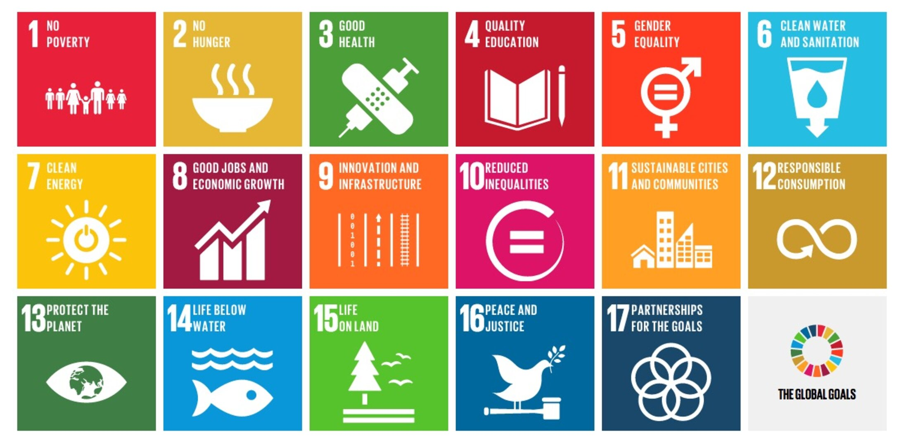

## Soils in a museum?

Soil museums make the invisible visible. They preserve soil specimens, profiles, knowledge and stories, and create spaces where people can discover the diversity and importance of soils.

## What is the Global Soil Museum Network?   

The Global Soil Museum Network brings together soil museums from around the worked to reveal the importance and diversity of the world’s soils. The network creates opportunities for science to meet culture, and local soil stories to become part of a global narrative. The network will facilitate introducing soil to people of all ages, and to share knowledge on soil as a living ecosystem that sustains civilizations, regulates climate, preserves history, and secures our future. The network is an independent, non-profit network facilitated by ISRIC and closely connected with the World Soil Museum based in Wageningen, the Netherlands. The Network is coordinated by a management team consisting of representatives selected from participating soil museums, while ISRIC will serve as the network's secretariat. 

## Why build the Global Soil Museum Network?    

Well formulated and accessible soil knowledge is key to achieve many of the United Nations’ Sustainable Development Goals (SDGs), such as ending poverty and hunger, ensuring quality education, protecting biodiversity, managing land sustainably, taking climate action, and partnering for sustainable development.  

The Global Soil Museum Network connects museums to universities, researchers, soil communities, soil science societies, artists, citizens, policy makers, and farmers across countries and continents to enhance the visibility of this important source, ensuring that every person values, understands and protects soil as the living foundation of life.   

Together, we cultivate a global soil literacy movement that inspires action, from classrooms to farms, from cities to forests, from policymakers to citizens, ensuring that future generations inherit healthy soils and a resilient planet. 

## From soil collections to a global network

Soil collections and soil museums have a long tradition within soil science. National and regional institutions have collected soil monoliths, profiles, samples, photographs and other materials to document the diversity of soils and landscapes.

Over time, these collections became important not only for scientific research, but also for teaching, public education and communicating the importance of soils.

The idea of connecting soil museums internationally grew from this shared heritage. The Global Network of Soil Museums builds on earlier efforts to bring institutions and collections together, while creating a more visible and accessible international community for the future.

## Facilitated by ISRIC

[ISRIC – World Soil Information](https://isric.org), based at Wageningen University & Research, is an international centre for soil information. Through the [World Soil Museum](https://wsm.isric.org) and its broader work on soil information, ISRIC has a long-standing role in preserving, documenting and communicating knowledge about the world's soils.

ISRIC facilitates the Global Network of Soil Museums by helping connect participating institutions, support knowledge exchange, maintain the network's digital presence and encourage collaboration between museums and collections worldwide.

- Network leader - Stephan Mantel
- Network coordinator - Kurshid Chrow

## What does the network do?

**Connect**
Bringing soil museums and collections into contact across borders.

**Share**
Exchanging knowledge, practices, educational materials and experiences.

**Preserve**
Supporting the long-term visibility and preservation of soil collections.

**Educate**
Promoting innovative ways to communicate the importance of soils.

**Collaborate**
Creating opportunities for joint exhibitions, research, digitisation and outreach.

## Looking ahead

The Global Network of Soil Museums aims to make the world's soil collections more connected, visible and accessible. By working together, soil museums can reach new audiences, share expertise and demonstrate why understanding and protecting soils matters for our common future.

## Join the network or locate a museum close to you

Locate the [current members](list.md), or let us know if you are interested to [join the network](join.md).